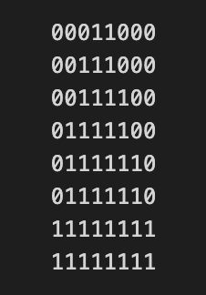

# Tile Packer

## Overview

The goal of this atlas packer algorithm was to see if it was feasible to get good atlas packing of images with concave shapes, and at the same time do it in an efficient manner.

The base idea was to do `"per pixel"` checks for an image to see what the performance as well as the result would actually be like.

As it turns out, it works very well, with sub second generation of large atlases with reasonably tight packing.

## The algorithm

### Sorting

The algorithm first sorts the incoming images based on size in decreasing order.

### Tile image

Each image is converted to a `tile image`, which is a black and white, scaled down version of the original image.
It uses the configurable setting `tile_size` (e.g. 16) to convert each 16x16 block of texels into a `0` or a `1`. The `1` means that in that 16x16 block of texels in the original image, there is at least one texel that is non zero.

_A 128x128 image of a triangle converted to a tile image with tile size 16:_
<br>


### Rotated images

Since we want to be able to fit rotated images as well, we also create rotated tile images for the 90, 180 and 270 degree rotations.

_One can also imagine supporting flipped images as well._

### Fitting

Similarly the target atlas page is in the tile image format.
For each image that we want to fit into the atlas, we do a "per pixel" check with the current atlas page.

_Pseudo code for checking if an image fits within a page_
```lua
function fitInPage(page, image)
    for page_y in page.tile_image.height:
        for page_x in page.tile_image.width:
            for tile_image in image.tile_images:
                if checkOverlap(page.tile_image, page_x, page_y,tile_image)
                    return true
    return false
```

### Vertex generation

For each tile image, we greedily fit boxes into the filled tiles, in order to minimize the number of boxes.

Each box is then used to generate two triangles.

_WIP begin_

We store the list of vertices as well as an index list.

_WIP end_
### All together

_Pseudo code for the overall algorithm_
```lua
    sort(images)

    foreach image in images:
        makeTileImages(image)

    pages = [createPage()]

    iterator = iterate(images)
    foreach image in iterator:
        fit = false

        for page in pages:
            fit = fitInPage(page, image)
            if fit:
                break

        if not fit:
            -- Add a new page to fit it into (or grow the current one)
            pages.append( createPage() )
            -- try with the same image again
            iterator.insert_front(image)

    writeToAtlas(images)
```

## Drawbacks

As expected, smaller tile sizes (e.g. 4 or 8) increase the generation time a lot.

The tiles introduce some unwanted waste of space as you increase the tile size (as expected).

## Examples

_All timings are without the I/O of reading/writing png's_
_The timings are taken on my Macbook M1 Pro 2021_

Credits:
* All the source images are downloaded from [Kenney Assets](https://www.kenney.nl/assets?q=2d)

_4812 images, generating a 8192x4096 image, using tile_size: 16, in <400 ms_
